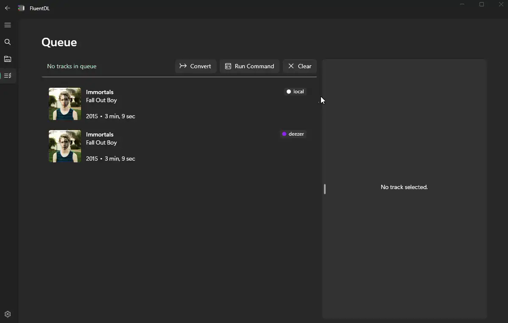

<h1 align="center">
  FluentDL
</h1>

<p align="center">
  <a href="https://github.com/derekyang2/fluentdl/releases/latest">
    
  </a>
</p>


<p align="center">
  <a href="#about">About</a> •
  <a href="#build">Build</a> •
  <a href="#installation">Installation</a> •
   <a href="#authentication">Authentication</a>
</p>

<p align="center">
  
</p>

## About
A Fluent UI desktop application that helps you download lossless songs as FLACs, convert between audio formats, match songs between different online sources, edit song metadata, and more. This project was made with [WinUI 3](https://github.com/microsoft/microsoft-ui-xaml) and [TemplateStudio](https://github.com/microsoft/TemplateStudio). Under the hood, the app uses FFmpeg and APIs from Deezer, Qobuz, Spotify, and Youtube.

FluentDL is organized into three sections: Search, Local Explorer, and Queue.

<table>
  <tr>
    <td valign="top">
      <strong>Search</strong>
      <ul>
        <li>Lookup songs from any of the four online sources</li>
        <li>Search using natural language or strict search by title/artist/album</li>
        <li>Parse all tracks from an online link, with track/album/playlist links supported</li>
        <li>Open songs in preview sidebar that can view large cover art, preview audio, show full metadata</li>
      </ul>
    </td>
    <td>
      <p align="center"></p>
    </td>
  </tr>
  <tr>
    <td valign="top">
      <strong>Local Explorer</strong>
      <ul>
        <li>Upload files from your computer or scan all audio files in a folder</li>
        <li>View file metadata and technical audio specs in-depth</li>
        <li>Edit file metadata live, including option to change cover art!</li>
        <li>Convert between flac, mp3, aac, alac, vorbis, opus with control over bitrate</li>
      </ul>
    </td>
    <td>
      <p align="center"></p>
    </td>
  </tr>
  <tr>
    <td valign="top">
      <strong>Queue</strong>
      <ul>
        <li>Add files from Search or Local Explorer into the queue</li>
        <li>Run custom terminal tools on tracks (with wildcards)</li>
        <li>Match between any of the online sources (e.g., convert Spotify and YouTube to Deezer equivalents)</li>
        <li>Download tracks from Deezer, Qobuz, or Youtube with maximum quality</li>
        <li>Download entire queue using Convert: select Local as output</li>
      </ul>
    </td>
    <td>
      <p align="center"></p>
    </td>
  </tr>
</table>

TIP: change the number of threads in settings for significantly faster conversions, matching, and downloading.

## Installation 
This project is deployed using MSIX, which installs the application on Windows. To install this application, download the first zip from [Releases](https://github.com/DerekYang2/FluentDL/releases).

### Option 1
The application may be installed directly using a powershell script located in the zip folder. In the root folder inside of the zip, you should see an `Install.ps1` file and other files such as `FluentDL_{VERSION}_x64_MSIX.msix`. 

Right click on `Install.ps1` and press `Run with PowerShell`.

### Option 2

If that option is not available, open Powershell or CMD into the root directory and run the command:

```powershell.exe -executionpolicy unrestricted .\Install.ps1```

The application is now installed, and you should be able to find "FluentDL" with Search or in your Apps list.

## Build

Your machine should have the ability to develop WinUI 3 applications. See the official installation and setup guides, [Install tools for the Windows App SDK
](https://learn.microsoft.com/en-us/windows/apps/windows-app-sdk/set-up-your-development-environment?tabs=cs-vs-community%2Ccpp-vs-community%2Cvs-2022-17-1-a%2Cvs-2022-17-1-b) and [Create your first WinUI 3 project](https://learn.microsoft.com/en-us/windows/apps/winui/winui3/create-your-first-winui3-app).

Then, open the Solution file `.\FluentDL\FluentDL.sln` using Visual Studio.

An [experimental package](https://github.com/CommunityToolkit/Labs-Windows/issues/426) must be installed seperately, but latest assemblies are not compatible with .NET 7. A migration to .NET 8 is in progress, which fixes the build errors caused by marquee text. Read more about the issue [here](https://github.com/DerekYang2/FluentDL/issues/3). TDLR; building is sort of broken right now, temporary fix hopefully coming soon. 

The pre-built FFmpeg executable is found at [./Assets/ffmpeg/bin](https://github.com/DerekYang2/FluentDL/tree/master/Assets/ffmpeg/bin) and contains many additional codecs, such as libopus and libvorbis. 
 
You may use your own FFmpeg binaries, but note that libopus is required for Youtube's highest quality source.

## Authentication

Before using the application, head over to the settings page through the sidebar. 

Searching songs does not require authentication, however Spotify is the only exception. Spotify will require API tokens (a client ID and client secret) which can be entered in the settings page. For more details on obtaining these tokens, visit the [official documentation](https://developer.spotify.com/documentation/web-api/tutorials/getting-started).

Downloading from Youtube does not require authentication.
Downloading from Deezer and Qobuz require authenticated through ARLs and Tokens respectively. 
You do not have re-enter credentials each time because they are stored locally. Note that tokens expire or may break due to occasional web-player changes. 

Deezer and Qobuz FLAC sources are only accessible with premium accounts. [Here](https://erikstechcorner.com/2020/09/how-to-check-if-your-flac-files-are-really-lossless/) is a guide on using Spek to verify your file quality.

### Retrieving Tokens
If you already have them, enter them in settings. Otherwise:

In order to obtain your Deezer ARL, log into [https://www.deezer.com/](https://www.deezer.com/). Then open Developer Tools, and head to the `Application` tab. In the sidebar, open the dropdown list for `Cookies` and there should be an subitem `https://www.deezer.com/`. Click on the subitem and to find the the `arl` value, which should be 192 characters long. Note that you should open the _dropdown_ for the `Cookies` section, not click on it.

Similarly, to obtain a Qobuz id and token, log into [https://play.qobuz.com/](https://play.qobuz.com/) and open Developer Tools. Head over the `Application` tab, open the dropdown list for `Local Storage` and click on the subitem `https://play.qobuz.com`. You should then click on the `localuser` JSON object in the viewing window, where you can find the fields `id` (7 digits) and `token` (86 characters). 
